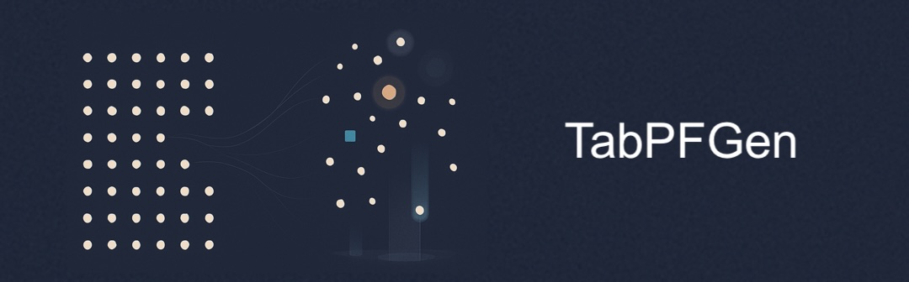

# TabPFGen: Synthetic Tabular Data Generation with TabPFN

[](https://badge.fury.io/py/tabpfgen)
[](https://opensource.org/licenses/MIT)



TabPFGen is a Python library for generating high-quality synthetic tabular data using energy-based modeling and stochastic gradient Langevin dynamics (SGLD). Built on the TabPFN transformer architecture, it supports both classification and regression tasks with comprehensive visualization tools.

## Key Features

- Energy-based synthetic data generation without additional training
- Support for both classification and regression tasks
- Class-balanced sampling option for imbalanced datasets
- Comprehensive visualization tools to validate synthetic data quality
- Built on pre-trained TabPFN transformer architecture

## Why TabPFGen?

While many tools exist for generating synthetic images or text, creating realistic tabular data that preserves the statistical properties of the original dataset has been challenging. TabPFGen addresses this need by leveraging the power of TabPFN and energy-based modeling.

TabPFGen is especially useful when:

1. You have limited real data but need more samples for training
2. You can't share real data due to privacy concerns
3. You need to balance an imbalanced dataset
4. You want to test how your models would perform with more data

## Installation

```bash
pip install tabpfgen
```

## Quick Start

### Classification Example

```python
from tabpfgen import TabPFGen
from tabpfgen.visuals import visualize_classification_results
from sklearn.datasets import load_breast_cancer

# Load data
X, y = load_breast_cancer(return_X_y=True)

# Initialize generator
generator = TabPFGen(n_sgld_steps=500)

# Generate synthetic data
X_synth, y_synth = generator.generate_classification(
    X, y,
    n_samples=100,
    balance_classes=True
)

# Visualize results
visualize_classification_results(
    X, y, X_synth, y_synth,
    feature_names=load_breast_cancer().feature_names
)
```

### Regression Example

```python
from tabpfgen import TabPFGen
from tabpfgen.visuals import visualize_regression_results
from sklearn.datasets import load_diabetes

# Load regression dataset
X, y = load_diabetes(return_X_y=True)

# Initialize generator
generator = TabPFGen(n_sgld_steps=500)

# Generate synthetic regression data
X_synth, y_synth = generator.generate_regression(
    X, y,
    n_samples=100,
    use_quantiles=True
)

# Visualize results
visualize_regression_results(
    X, y, X_synth, y_synth,
    feature_names=load_diabetes().feature_names
)
```

## Documentation

For detailed documentation and tutorials, visit our [tutorial pages](https://github.com/sebhaan/TabPFGen/blob/main/tutorial/index.md).

## How It Works

TabPFGen uses a two-step approach:

1. **Feature Generation**: Using SGLD (Stochastic Gradient Langevin Dynamics) guided by an energy function to create synthetic features that statistically resemble the original data.

2. **Target Prediction**: Leveraging TabPFN as an "expert consultant" to predict appropriate target values (classification labels or regression values) for the synthetic features.

The entire process is guided by an energy function that compares synthetic data points to the original data, ensuring statistical similarity.

## Visualization

TabPFGen includes comprehensive visualization tools to help verify the quality of your synthetic data:

- Class distribution comparisons
- Feature distribution analysis
- Feature correlation matrices
- t-SNE visualizations
- Feature importance analysis

## License

This project is licensed under the MIT License - see the LICENSE file for details.