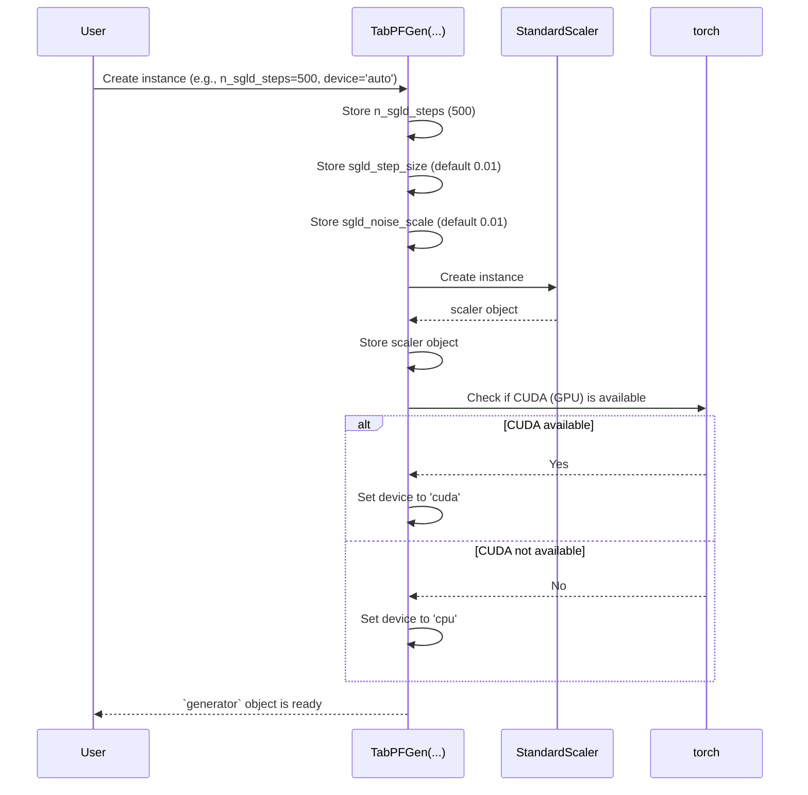

# Chapter 1: The `TabPFGen` Class - Your Synthetic Data Control Panel

Welcome to the `TabPFGen` tutorial! Imagine you have a dataset, maybe information about customers or results from scientific experiments. Sometimes, you might wish you had *more* data like it, perhaps because your original dataset is small, or you can't share the real data due to privacy rules. This is where `TabPFGen` comes in – it's like a magical factory that can create new, artificial data that looks and behaves very much like your original data.

In this first chapter, we'll meet the factory manager: the `TabPFGen` class. Think of this class as the main **control panel** for your synthetic data generation factory. It's the very first thing you'll interact with when using the `TabPFGen` library.

## What is the `TabPFGen` Class?

The `TabPFGen` class is the primary way you'll use this library. You create an "instance" or an "object" of this class to get started. This object holds the settings for your data generation process and provides the tools (methods) to actually create the synthetic data.

It's like setting up your factory: you decide how many refinement steps the workers should take, how big those steps should be, and where the work should happen (on your computer's main processor or a graphics card).

## Getting Started: Creating Your Control Panel

Let's see how simple it is to set up your `TabPFGen` control panel. First, you need to import it from the library:

```python
# Import the main class from the library
from tabpfgen import TabPFGen
```

This line tells Python: "I want to use the `TabPFGen` tool."

Now, let's create our actual control panel object. We need to give it some basic instructions, like how many refinement steps (`n_sgld_steps`) it should perform later. Don't worry too much about what this means yet; think of it as setting the "effort level" for the factory.

```python
# Create an instance of the TabPFGen class
# We'll set the number of refinement steps to 500 for this example
generator = TabPFGen(n_sgld_steps=500)

print("TabPFGen control panel created!")
# Expected Output:
# TabPFGen control panel created!
```

That's it! You've now created a `generator` object. This `generator` is your ready-to-use control panel. It knows it needs to perform 500 refinement steps when you ask it to generate data later. We haven't generated any data yet, but we've set up the tool to do so.

## Key Settings (Parameters) of `TabPFGen`

When you create the `TabPFGen` object, you can configure a few important settings (parameters):

*   `n_sgld_steps` (Number of SGLD steps):
    *   **What it is:** How many small refinement steps the process takes to generate the data.
    *   **Analogy:** Imagine sculpting clay. This is the number of small adjustments you make to get the shape just right. More steps *can* lead to better results but take more time. (Default: 1000)
    *   This parameter directly controls the core sampling mechanism, which we'll explore in [Chapter 5: SGLD Sampling (`_sgld_step`)](05_sgld_sampling____sgld_step___.md).
*   `sgld_step_size` (SGLD step size):
    *   **What it is:** How big each refinement step is.
    *   **Analogy:** When sculpting, are you making tiny pinches or larger pushes? A smaller step size is more cautious but might take longer to reach the final shape. (Default: 0.01)
*   `sgld_noise_scale` (SGLD noise scale):
    *   **What it is:** A small amount of randomness added at each step.
    *   **Analogy:** Think of it as slightly jiggling the clay during sculpting. This helps explore different possibilities and avoid getting stuck in one shape. (Default: 0.01)
*   `device` (Computing device):
    *   **What it is:** Tells `TabPFGen` where to do the heavy calculations – on the main brain of your computer ('cpu') or a specialized graphics card ('cuda') if you have one (which is often faster).
    *   **Analogy:** Choosing your workshop. 'cpu' is the standard workshop, 'cuda' is a high-speed, specialized one. 'auto' lets `TabPFGen` choose the best available. (Default: 'auto')

You usually only need to set `n_sgld_steps`, but it's good to know the others exist!

```python
# Example creating a generator with more settings specified
generator_custom = TabPFGen(
    n_sgld_steps=800,      # Use 800 refinement steps
    sgld_step_size=0.005,  # Use a smaller step size
    device='cpu'           # Force using the CPU
)

print("Custom TabPFGen control panel created!")
# Expected Output:
# Custom TabPFGen control panel created!
```

## What Happens When You Create `TabPFGen`? (Under the Hood)

When you write `generator = TabPFGen(...)`, a few things happen behind the scenes:

1.  **Settings Saved:** The parameters you provide (`n_sgld_steps`, etc.) are stored inside the `generator` object.
2.  **Scaler Prepared:** An internal tool called `StandardScaler` is created. This tool is used later to standardize your data (making sure all features have a similar scale, which helps the generation process). Think of it as grabbing the right measuring tools before starting work.
3.  **Device Chosen:** The code figures out whether to use the 'cpu' or 'cuda' based on your input and what's available on your computer.

Let's visualize this simple setup process:



Looking at the code in `src/tabpfgen/tabpfgen.py`, the `__init__` method (the special function called when you create the object) does exactly this:

```python
# Simplified view from src/tabpfgen/tabpfgen.py

from sklearn.preprocessing import StandardScaler
import torch

class TabPFGen:
    def __init__(
        self,
        n_sgld_steps: int = 1000,
        sgld_step_size: float = 0.01,
        sgld_noise_scale: float = 0.01,
        device: str = "auto"
    ):
        """Initializes the TabPFGen control panel."""
        # Store the settings you provided
        self.n_sgld_steps = n_sgld_steps
        self.sgld_step_size = sgld_step_size
        self.sgld_noise_scale = sgld_noise_scale

        # Create the data scaler tool
        self.scaler = StandardScaler()

        # Figure out the computation device ('cpu' or 'cuda')
        self.device = self._infer_device(device)
        print(f"Using device: {self.device}") # Added for clarity

    def _infer_device(self, device: str) -> torch.device:
        """Helper function to determine the device."""
        if device == "auto":
            # If 'auto', check if CUDA (GPU) is available
            return torch.device("cuda" if torch.cuda.is_available() else "cpu")
        else:
            # Otherwise, use the device specified ('cpu' or 'cuda')
            return torch.device(device)

# Example of creating an instance
generator = TabPFGen(n_sgld_steps=500, device='auto')
# Expected Output might be:
# Using device: cuda
# (or "Using device: cpu" if no compatible GPU is found)
```

This code simply takes your settings, saves them within the `generator` object, creates a `StandardScaler`, and calls the helper function `_infer_device` to select the best computing device based on your preference and system capabilities.

## What's Next?

You now have your `TabPFGen` control panel (`generator`) ready! It holds the settings for your synthetic data factory.

The next step is to learn how this `generator` actually uses the underlying TabPFN model – the "engine" of our factory. We'll see how `TabPFGen` integrates with TabPFN in the next chapter. Later, we'll use this `generator` object's methods like `generate_classification` and `generate_regression` to create the actual synthetic data.

Ready to look inside the engine room? Let's move on to [Chapter 2: TabPFN Integration](02_tabpfn_integration_.md).

---

Generated by [AI Codebase Knowledge Builder](https://github.com/The-Pocket/Tutorial-Codebase-Knowledge)