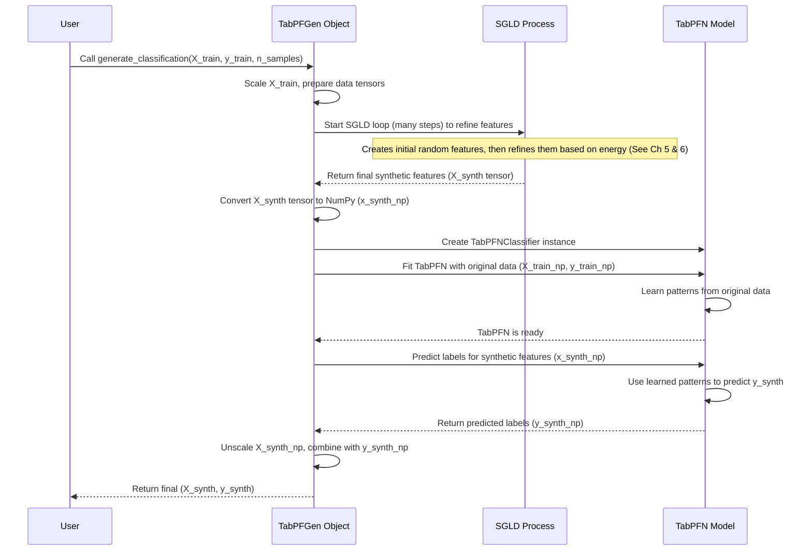

# Chapter 2: TabPFN Integration - The Smart Assistant Inside

In [Chapter 1: The `TabPFGen` Class - Your Synthetic Data Control Panel](01_tabpfgen_class_.md), we set up our synthetic data factory using the `TabPFGen` class as our control panel. Now, let's peek inside the factory and meet the "smart assistant" that makes `TabPFGen` so effective: **TabPFN**.

## Why Do We Need TabPFN?

Imagine you're trying to draw realistic pictures of cats. You could start from scratch, learning every detail about cat anatomy, fur patterns, and poses. Or, you could get help from an expert cat artist who already knows all this!

`TabPFGen` takes the second approach. Instead of learning everything about your tabular data from zero, it cleverly uses a pre-trained model called **TabPFN**.

**TabPFN (Tabular Prior-data Fitted Network)** is like that expert artist, but for tables. It's a powerful model that has already been trained on a huge variety of tabular datasets. This means it already understands many common patterns, relationships, and structures found in tables with rows and columns.

`TabPFGen` leverages this pre-existing knowledge. It doesn't train a completely new generator model. Instead, it focuses on generating the *features* (columns) of your synthetic data and then uses TabPFN like an **expert consultant** to figure out the best *target values* (like labels in classification or values in regression) for those features.

## How `TabPFGen` Uses TabPFN: A Two-Step Process

The core idea is simple. `TabPFGen` divides the generation process into two main phases:

1.  **Generate Features (`X_synth`):** `TabPFGen` uses a technique called SGLD (which we'll explore in detail in [Chapter 5: SGLD Sampling (`_sgld_step`)](05_sgld_sampling____sgld_step___.md)) to create the raw features (columns) of your new synthetic data. Think of this as sculpting the basic shapes of your data points. Let's call these synthetic features `X_synth`.

2.  **Predict Targets (`y_synth`) with TabPFN:** Once `TabPFGen` has the synthetic features (`X_synth`), it brings in the expert – TabPFN. It shows TabPFN the original data (`X_train`, `y_train`) so TabPFN understands the specific patterns of *your* dataset. Then, it asks TabPFN: "Based on the patterns you learned from the original data, what should the target values (`y_synth`) be for these new synthetic features (`X_synth`)?" TabPFN makes predictions, and these predictions become the labels or target values for your synthetic data.

**Analogy:** Imagine `TabPFGen`'s SGLD process sculpts blank clay figures (`X_synth`) that resemble the shapes in your original collection. Then, TabPFN, the expert painter, carefully paints the correct colors and details (`y_synth`) onto each figure, making sure they look consistent with the original collection.

This way, the generated features (`X_synth`) and targets (`y_synth`) are linked together in a way that respects the patterns TabPFN learned from the original data.

## Conceptual Example: Generating Patient Data

Let's say your original data has patient features (age, blood pressure) and a target indicating if they have a certain condition (Yes/No).

1.  **Feature Generation:** `TabPFGen` generates new, synthetic rows of `age` and `blood pressure` (`X_synth`) that look statistically similar to the original patient data.
2.  **Target Prediction:** `TabPFGen` then uses TabPFN:
    *   It shows TabPFN the original `(age, blood pressure)` data and their corresponding `condition` labels.
    *   It asks TabPFN to predict the `condition` (`y_synth`) for the newly generated `(age, blood pressure)` rows (`X_synth`).
    *   TabPFN uses its knowledge to predict 'Yes' or 'No' for each synthetic patient, ensuring the relationship between features and the condition makes sense according to the original data's patterns.

## Where Does This Happen? (A Glimpse Inside)

This integration happens inside the main generation methods of the `TabPFGen` object you created in Chapter 1. We'll explore these methods in detail later, but here's a simplified view of where TabPFN steps in:

```python
# --- Simplified view inside generate_classification or generate_regression ---
from tabpfn import TabPFNClassifier, TabPFNRegressor
import torch
import numpy as np

# (Assume generator object, X_train, y_train exist)
# (Assume X_train is scaled to x_train_tensor, y_train to y_train_tensor)
# (Assume x_train_np, y_train_np are numpy versions)

# 1. Generate synthetic features (X_synth) using SGLD
# ... Many SGLD steps happen here using methods like _sgld_step ...
# x_synth_tensor = result_of_sgld_steps(...) # Placeholder
x_synth_tensor = torch.randn(100, X_train.shape[1]) # Example dummy features
x_synth_np = x_synth_tensor.cpu().numpy()          # Convert to NumPy

print("Step 1: Synthetic features (X_synth) generated.")

# 2. Use TabPFN to predict targets (y_synth)

# Check if it's a classification or regression task (simplified)
is_classification = len(np.unique(y_train)) < 20 # Heuristic

if is_classification:
    print("Using TabPFN Classifier.")
    # Create a TabPFN Classifier instance
    expert_predictor = TabPFNClassifier(device=generator.device)
    # Show TabPFN the original data patterns
    expert_predictor.fit(x_train_np, y_train_np)
    # Ask TabPFN to predict probabilities for synthetic features
    probabilities = expert_predictor.predict_proba(x_synth_np)
    # Choose the most likely class label
    y_synth_np = probabilities.argmax(axis=1)
else: # Regression task
    print("Using TabPFN Regressor.")
    # Create a TabPFN Regressor instance
    expert_predictor = TabPFNRegressor(device=generator.device)
    # Show TabPFN the original data patterns
    expert_predictor.fit(x_train_np, y_train_np) # Using scaled y here
    # Ask TabPFN to predict target values for synthetic features
    predictions = expert_predictor.predict(x_synth_np)
    y_synth_np = predictions # Use the direct predictions

print("Step 2: TabPFN predicted targets (y_synth).")

# ( ... later steps involve unscaling X_synth_np and y_synth_np ... )
# Final output would be X_synth_final, y_synth_final
```

This snippet shows the core logic:
1.  Some process (SGLD, covered in [Chapter 5](05_sgld_sampling____sgld_step___.md)) generates `x_synth_np`.
2.  The appropriate TabPFN model (`TabPFNClassifier` or `TabPFNRegressor`) is created.
3.  `expert_predictor.fit(x_train_np, y_train_np)` teaches TabPFN about *your specific* dataset's patterns.
4.  `expert_predictor.predict_proba(...)` or `expert_predictor.predict(...)` asks TabPFN to generate the corresponding `y_synth` for the synthetic `x_synth_np`.

## Under the Hood: The Sequence of Events

Let's visualize the high-level process when you call a generation method like `generate_classification`:



This shows that `TabPFGen` orchestrates the process: it uses SGLD for feature generation and then calls upon the pre-trained TabPFN model as a specialized tool to determine the appropriate targets, ensuring the final synthetic data is coherent.

## Why This Integration is Smart

*   **Leverages Existing Knowledge:** Doesn't waste time learning basic tabular patterns TabPFN already knows.
*   **No Generator Training:** `TabPFGen` itself doesn't require lengthy training like many other generative models. It relies on the pre-trained TabPFN.
*   **Feature-Target Consistency:** Ensures the generated `y_synth` makes sense for the generated `X_synth` based on the original data's logic, as interpreted by TabPFN.
*   **Focus:** Allows the SGLD process ([Chapter 5](05_sgld_sampling____sgld_step___.md)) to focus solely on generating realistic feature distributions (`X_synth`), leaving the target generation to the expert (TabPFN).

## What's Next?

Now that we understand how `TabPFGen` cleverly partners with the pre-trained TabPFN model, we're ready to see how this works in practice for specific tasks.

In the next chapter, we'll dive into the first main use case: generating synthetic data for classification problems using the `generate_classification` method. Let's move on to [Chapter 3: Classification Generation (`generate_classification`)](03_classification_generation___generate_classification___.md).

---

Generated by [AI Codebase Knowledge Builder](https://github.com/The-Pocket/Tutorial-Codebase-Knowledge)