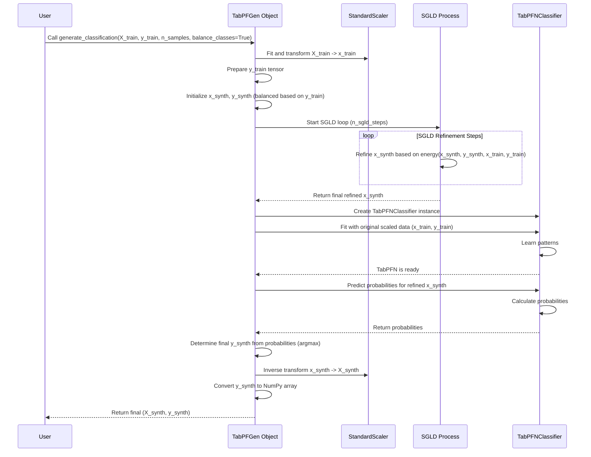

# Chapter 3: Classification Generation (`generate_classification`)

Welcome back! In [Chapter 2: TabPFN Integration - The Smart Assistant Inside](02_tabpfn_integration_.md), we learned how our `TabPFGen` control panel cleverly uses the pre-trained TabPFN model as an expert assistant. Now, let's put this into practice for a common task: **classification**.

Imagine you have a dataset of emails, labeled as "Spam" or "Not Spam". This is a classification problem because the target (the label) belongs to distinct categories. What if your dataset has very few "Spam" examples? Your machine learning model might struggle to learn how to detect spam effectively. This is where `generate_classification` comes in – it helps you create *new*, artificial email data, complete with "Spam" or "Not Spam" labels, that resembles your original data.

## What is `generate_classification`?

`generate_classification` is the specific tool (a "method") within your `TabPFGen` object designed for creating synthetic data for classification tasks. It orchestrates a workflow:

1.  It takes your original features (`X_train`) and class labels (`y_train`).
2.  It intelligently creates initial starting points for your new synthetic data features.
3.  It refines these features step-by-step using a process guided by an energy function (we'll learn more about this in [Chapter 5: SGLD Sampling (`_sgld_step`)](05_sgld_sampling____sgld_step___.md) and [Chapter 6: Energy Function (`_compute_energy`)](06_energy_function____compute_energy___.md)).
4.  Crucially, it then uses the `TabPFNClassifier` (our expert assistant from Chapter 2) to assign the most probable class label ("Spam" or "Not Spam" in our example) to each newly generated synthetic feature set.
5.  Finally, it gives you back the brand new synthetic features (`X_synth`) and their corresponding labels (`y_synth`).

## Using `generate_classification`: Creating Synthetic Emails

Let's see how to use this tool. First, assume you have your `generator` object ready (from [Chapter 1: The `TabPFGen` Class - Your Synthetic Data Control Panel](01_tabpfgen_class_.md)) and your email data loaded into `X_emails` (features like word counts) and `y_labels` (0 for "Not Spam", 1 for "Spam").

```python
# Assume 'generator' is your initialized TabPFGen object
# Assume X_emails and y_labels are your NumPy arrays with real data

# --- Let's imagine some simple fake data ---
import numpy as np
# Fake features (e.g., word counts) for 50 emails
X_emails = np.random.rand(50, 10)
# Fake labels (mostly 'Not Spam' - 0, few 'Spam' - 1)
y_labels = np.array([0]*45 + [1]*5)
# --- End of fake data setup ---

print(f"Original data shape: X={X_emails.shape}, y={y_labels.shape}")
print(f"Original class distribution: {np.bincount(y_labels)}")

# Ask the generator to create 100 new synthetic email examples
# We'll ask it to try and balance the classes (get roughly 50/50 spam/not spam)
X_synth_emails, y_synth_labels = generator.generate_classification(
    X_train=X_emails,         # Your original features
    y_train=y_labels,         # Your original labels
    n_samples=100,            # How many new samples to create
    balance_classes=True      # Try to make classes equal in new data? Yes!
)

print("\nSynthetic data generated!")
print(f"Synthetic data shape: X={X_synth_emails.shape}, y={y_synth_labels.shape}")
print(f"Synthetic class distribution: {np.bincount(y_synth_labels)}")

# Expected Output (shapes and counts will match, specific values differ):
# Original data shape: X=(50, 10), y=(50,)
# Original class distribution: [45  5]
# Step 0/500  (This message might appear depending on n_sgld_steps)
# Step 100/500
# Step 200/500
# Step 300/500
# Step 400/500
#
# Synthetic data generated!
# Synthetic data shape: X=(100, 10), y=(100,)
# Synthetic class distribution: [50 50] # Note: Roughly balanced classes!
```

In this code:

1.  We provide our original data (`X_emails`, `y_labels`) to the `generate_classification` method.
2.  We specify we want `n_samples=100` new synthetic emails.
3.  We set `balance_classes=True`. This is important! Our original data was *imbalanced* (45 "Not Spam", 5 "Spam"). By setting this to `True`, we tell `TabPFGen` to try and create synthetic data where the classes are more *balanced* (closer to 50 "Not Spam", 50 "Spam"). This can be very helpful for training better models. If set to `False`, the synthetic data would likely mimic the original imbalance.
4.  The method returns two NumPy arrays: `X_synth_emails` (the features of the 100 new emails) and `y_synth_labels` (the corresponding "Spam"/"Not Spam" labels generated for them).

## How Does It Work Under the Hood?

When you call `generate_classification`, several things happen in sequence:

1.  **Scaling:** Your input features (`X_train`) are standardized (scaled) using the `StandardScaler` we met in Chapter 1. This helps the generation process work more reliably. Think of it as converting all measurements to a standard unit (like meters) before working with them.
2.  **Initialization:** Initial "seed" points for the synthetic features (`x_synth`) are created.
    *   If `balance_classes=True`, it tries to start with an equal number of points intended for each class, often by picking starting points near examples of each class from your original data. (Like grabbing an equal number of apple and orange seeds).
    *   If `balance_classes=False`, it might start with purely random points or points sampled according to the original data's class distribution. (Like grabbing seeds randomly from the original basket).
3.  **SGLD Refinement:** The core generation loop begins! For a set number of steps (`n_sgld_steps` you defined when creating `TabPFGen`), the synthetic feature points (`x_synth`) are iteratively adjusted. Each step uses the SGLD update rule, guided by the gradient of an "energy function". This process nudges the synthetic points to become more like the real data points, considering their features and intended classes. We'll dive into SGLD in [Chapter 5: SGLD Sampling (`_sgld_step`)](05_sgld_sampling____sgld_step___.md) and the energy function in [Chapter 6: Energy Function (`_compute_energy`)](06_energy_function____compute_energy___.md). Think of this as slowly sculpting the raw feature shapes.
4.  **TabPFN Labeling:** After the SGLD refinement, we have the final shapes for our synthetic features (`x_synth`). Now, the expert assistant steps in!
    *   A `TabPFNClassifier` instance is created.
    *   It's shown the *original* (scaled) data (`x_train`, `y_train`) using `.fit()` so it learns the specific patterns of your data (how features relate to "Spam" vs "Not Spam").
    *   It's then asked to predict the class probabilities for the *newly generated* synthetic features (`x_synth`) using `.predict_proba()`.
    *   The class with the highest predicted probability for each synthetic sample becomes its final label (`y_synth`). This ensures the labels assigned make sense based on the refined features and the patterns learned from the original data. (The expert painter colors the sculptures).
5.  **Unscaling:** The generated synthetic features (`x_synth`) are scaled back to their original range using the `StandardScaler`'s inverse transform.
6.  **Return:** The final, unscaled synthetic features (`X_synth`) and their corresponding labels (`y_synth`) are returned to you as NumPy arrays.

Let's visualize this flow:



## A Peek at the Code (`src/tabpfgen/tabpfgen.py`)

Let's look at a simplified version of the `generate_classification` function:

```python
# Simplified from src/tabpfgen/tabpfgen.py

import numpy as np
import torch
from tabpfn import TabPFNClassifier
# (Assuming self.scaler, self.device, self.n_sgld_steps exist)

class TabPFGen:
    # ... (other methods like __init__, _sgld_step, _compute_energy) ...

    def generate_classification(
        self,
        X_train: np.ndarray,
        y_train: np.ndarray,
        n_samples: int,
        balance_classes: bool = True
    ) -> tuple[np.ndarray, np.ndarray]:

        # 1. Scale Data
        X_scaled = self.scaler.fit_transform(X_train)
        x_train = torch.tensor(X_scaled, device=self.device, dtype=torch.float32)
        y_train_tensor = torch.tensor(y_train, device=self.device) # Renamed for clarity

        # 2. Initialize Synthetic Data Points
        if balance_classes:
            # ... (Code to create balanced x_synth, y_synth tensors) ...
            # Starts points near existing classes, aiming for equal numbers per class
            print("Initializing with balanced classes.")
            # Placeholder for complex initialization
            classes, counts = np.unique(y_train, return_counts=True)
            n_per_class = n_samples // len(classes)
            x_synth = torch.randn(n_samples, X_train.shape[1], device=self.device) # Simplified
            y_synth = torch.randint(0, len(classes), (n_samples,), device=self.device) # Simplified
        else:
            # ... (Code to create potentially imbalanced x_synth, y_synth tensors) ...
            print("Initializing without balancing.")
            x_synth = torch.randn(n_samples, X_train.shape[1], device=self.device) # Simplified
            y_synth = torch.randint(0, len(np.unique(y_train)), (n_samples,), device=self.device) # Simplified

        # 3. SGLD Refinement Loop
        print(f"Starting SGLD for {self.n_sgld_steps} steps...")
        for step in range(self.n_sgld_steps):
            # Call the SGLD update function (covered in Chapter 5)
            x_synth = self._sgld_step(x_synth, y_synth, x_train, y_train_tensor)
            # (Optional progress printing)
            # if step % 100 == 0: print(f"Step {step}/{self.n_sgld_steps}")

        print("SGLD refinement finished.")

        # 4. TabPFN Labeling
        x_synth_np = x_synth.detach().cpu().numpy() # Convert to NumPy for TabPFN
        x_train_np = x_train.cpu().numpy()         # Use NumPy version of scaled X_train
        y_train_np = y_train_tensor.cpu().numpy()  # Use NumPy version of y_train

        print("Using TabPFNClassifier to assign final labels...")
        clf = TabPFNClassifier(device=self.device) # Create the classifier
        clf.fit(x_train_np, y_train_np)            # Teach it original data patterns
        probs = clf.predict_proba(x_synth_np)      # Predict probabilities for synth data
        y_synth_final_np = probs.argmax(axis=1)    # Choose the most likely class

        # 5. Unscale Features
        X_synth_final = self.scaler.inverse_transform(x_synth_np)

        print("Synthetic data generation complete.")
        # 6. Return final NumPy arrays
        return X_synth_final, y_synth_final_np
```

This simplified code shows the key stages: scaling, initializing `x_synth` (potentially balanced), running the SGLD loop (calling `_sgld_step`, detailed in [Chapter 5](05_sgld_sampling____sgld_step___.md)), using `TabPFNClassifier` to get the final `y_synth`, and unscaling `X_synth`.

## Conclusion

You've now learned how to use `TabPFGen`'s `generate_classification` method to create synthetic data for classification problems. You understand the key steps involved, including initialization (with optional class balancing), SGLD refinement for features, and using TabPFN to assign meaningful labels. This is a powerful tool for augmenting small datasets or addressing class imbalance.

But what if your target isn't a category, but a continuous number, like predicting house prices or temperature? For that, `TabPFGen` has another specialized tool. Let's explore that next!

Ready to generate continuous values? Move on to [Chapter 4: Regression Generation (`generate_regression`)](04_regression_generation___generate_regression___.md).

---

Generated by [AI Codebase Knowledge Builder](https://github.com/The-Pocket/Tutorial-Codebase-Knowledge)