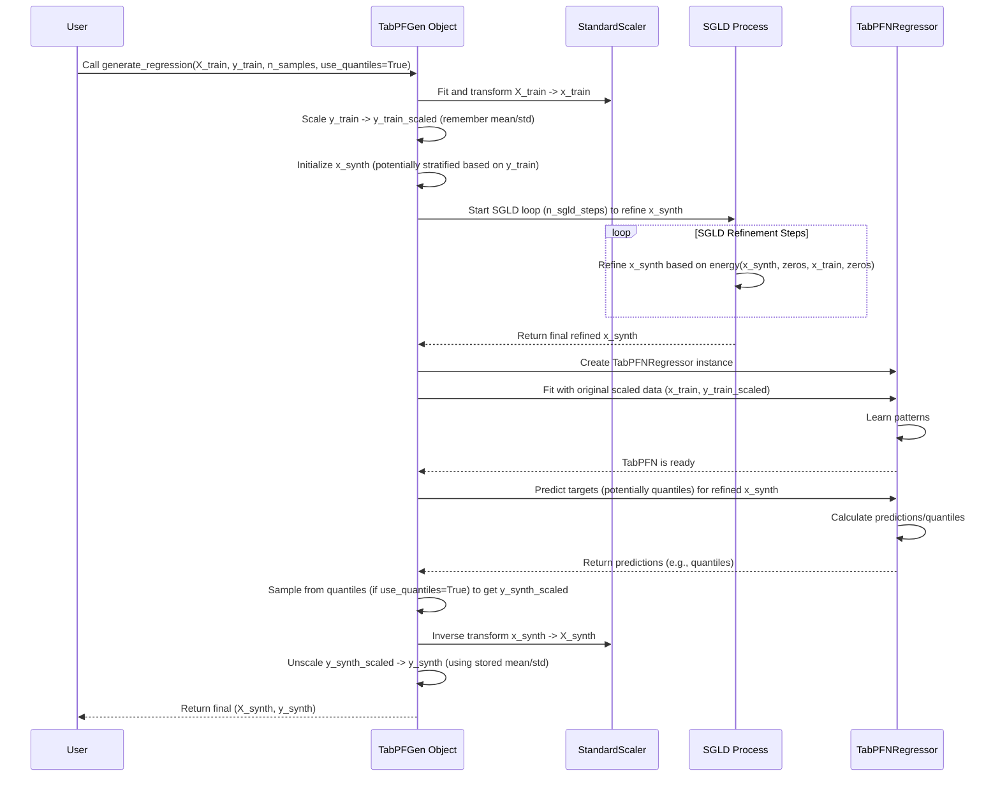

# Chapter 4: Regression Generation (`generate_regression`)

In the [previous chapter](03_classification_generation___generate_classification___.md), we saw how `TabPFGen` can create synthetic data for classification tasks, like distinguishing "Spam" from "Not Spam". But what if we're not sorting things into boxes, but predicting a number that can change smoothly, like the price of a house or the temperature tomorrow? This is called **regression**.

Imagine you have a small dataset of houses with features like square footage, number of bedrooms, and their sale prices. You want to train a model to predict prices, but you don't have much data. `TabPFGen` provides a specialized tool, `generate_regression`, to help create more artificial house data, complete with realistic features *and* plausible prices!

## What is `generate_regression`?

`generate_regression` is the method within your `TabPFGen` object designed specifically for generating synthetic data where the target variable (`y`) is a continuous number.

Here's the game plan it follows:

1.  **Learn from Real Data:** It looks at your original features (`X_train`) and their corresponding numerical target values (`y_train`).
2.  **Smart Feature Starting Points:** It creates initial guesses for the features (`X_synth`) of your new synthetic data. It might cleverly try to start these guesses in regions that cover the whole range of your original target values (`y_train`). For example, it might make sure to start some synthetic houses that resemble your originally *cheap* houses and others that resemble your originally *expensive* houses (this is called stratified sampling).
3.  **Refine Features:** It uses the step-by-step refinement process (SGLD, detailed in [Chapter 5: SGLD Sampling (`_sgld_step`)](05_sgld_sampling____sgld_step___.md)) to make the synthetic features (`X_synth`) statistically similar to your real features (`X_train`). Think of this as sculpting the raw shapes of the new houses based on the real ones.
4.  **Predict Target Values:** This is where the magic happens! It uses the expert assistant, `TabPFNRegressor` (part of the [TabPFN Integration](02_tabpfn_integration_.md)), to predict appropriate target values (`y_synth`) for the refined synthetic features (`X_synth`). It asks: "Based on the patterns in the original houses and prices, what prices would you estimate for these newly generated houses?"
5.  **Optional Diversity (Quantiles):** To make the generated prices more varied and realistic (not just the single "best guess"), it can optionally use *quantile predictions* from TabPFN. Instead of just getting the median predicted price, it might sample from the 10th percentile prediction, the 90th percentile, etc., adding diversity to the synthetic target values.
6.  **Deliver New Data:** It returns the newly created synthetic features (`X_synth`) and their corresponding predicted numerical targets (`y_synth`).

## Using `generate_regression`: Creating Synthetic House Prices

Let's use our `generator` object from [Chapter 1: The `TabPFGen` Class - Your Synthetic Data Control Panel](01_tabpfgen_class_.md) to create synthetic house data. Assume `X_housing` contains features (size, bedrooms) and `y_prices` contains the sale prices.

```python
# Assume 'generator' is your initialized TabPFGen object
# Assume X_housing and y_prices are your NumPy arrays with real data

# --- Let's imagine some simple fake data ---
import numpy as np
# Fake features (e.g., sq footage, num bedrooms) for 60 houses
X_housing = np.random.rand(60, 2) * np.array([[2000, 4]]) + np.array([[500, 1]])
# Fake prices (continuous values)
y_prices = 50000 + X_housing[:, 0] * 100 + X_housing[:, 1] * 10000 + np.random.randn(60) * 10000
# --- End of fake data setup ---

print(f"Original data shape: X={X_housing.shape}, y={y_prices.shape}")
print(f"Original price range: {y_prices.min():.0f} to {y_prices.max():.0f}")

# Ask the generator to create 120 new synthetic house examples
# We'll use the quantile option for more diverse prices
X_synth_housing, y_synth_prices = generator.generate_regression(
    X_train=X_housing,    # Your original features
    y_train=y_prices,     # Your original numerical targets (prices)
    n_samples=120,        # How many new samples to create
    use_quantiles=True    # Use quantile sampling for target diversity? Yes!
)

print("\nSynthetic data generated!")
print(f"Synthetic data shape: X={X_synth_housing.shape}, y={y_synth_prices.shape}")
print(f"Synthetic price range: {y_synth_prices.min():.0f} to {y_synth_prices.max():.0f}")

# Expected Output (shapes and counts will match, ranges will be similar):
# Original data shape: X=(60, 2), y=(60,)
# Original price range: 96889 to 300661 (Example range, will vary)
# Step 0/500  (This message might appear depending on n_sgld_steps)
# Step 100/500
# Step 200/500
# Step 300/500
# Step 400/500
#
# Synthetic data generated!
# Synthetic data shape: X=(120, 2), y=(120,)
# Synthetic price range: 98123 to 295478 (Example range, will vary)
```

In this code:

1.  We provide the original house features (`X_housing`) and prices (`y_prices`).
2.  We ask for `n_samples=120` new synthetic examples.
3.  We set `use_quantiles=True`. This tells `TabPFNRegressor` to not just predict the most likely price, but to sample from a range of plausible prices (like predicting the 10th percentile price, 50th, 90th, etc.) for different synthetic houses, leading to more realistic diversity in `y_synth_prices`. If set to `False`, it would likely use the median prediction for all synthetic samples.
4.  The method returns `X_synth_housing` (features of the 120 new houses) and `y_synth_prices` (the corresponding prices generated for them).

## How Does It Work Under the Hood?

Calling `generate_regression` triggers a specific sequence:

1.  **Scaling:** Just like in classification, the input features (`X_train`) and, importantly, the target values (`y_train`) are standardized (scaled). Scaling `y_train` helps `TabPFNRegressor` work effectively. Remember the original mean and standard deviation of `y_train` to unscale later!
2.  **Initialization (Features):** Initial synthetic features (`x_synth`) are created. The code often uses stratified sampling based on the original `y_train` values. This means it looks at the range of your original prices, divides it into segments (e.g., low, medium, high price ranges), and makes sure to start generating synthetic houses based on examples from *each* price segment. This helps ensure the final synthetic data covers the full spectrum.
3.  **SGLD Refinement (Features):** The SGLD loop runs for `n_sgld_steps`. It refines the synthetic features (`x_synth`) based on their similarity to the real features (`x_train`), guided by the [Energy Function (`_compute_energy`)](06_energy_function____compute_energy___.md). Note that for regression feature generation, the target values (`y`) are less directly involved in the `_sgld_step` itself compared to classification; the focus is on matching the feature distributions. (The sculpting of house shapes happens here).
4.  **TabPFN Price Estimation:** Once the synthetic features (`x_synth`) are refined, the expert appraiser (`TabPFNRegressor`) comes in.
    *   A `TabPFNRegressor` instance is created.
    *   It learns the relationship between features and (scaled) prices from your *original* data using `.fit(x_train, y_train_scaled)`.
    *   It then predicts target values for the *newly generated* synthetic features (`x_synth`) using `.predict()`.
    *   If `use_quantiles=True`, the `.predict()` method might return multiple quantile predictions (e.g., 10th, 20th... 90th percentile prices). The code then cleverly samples from these different quantile predictions for different synthetic houses to create a diverse set of `y_synth_scaled`.
    *   If `use_quantiles=False`, it typically uses the median prediction (the 50th percentile). (The expert appraiser estimates the prices).
5.  **Unscaling:** The generated synthetic features (`x_synth`) and the predicted scaled targets (`y_synth_scaled`) are scaled back to their original ranges using the stored scaling factors.
6.  **Return:** The final, unscaled synthetic features (`X_synth`) and their corresponding target values (`y_synth`) are returned as NumPy arrays.

Let's visualize this regression flow:



## A Peek at the Code (`src/tabpfgen/tabpfgen.py`)

Here's a simplified look at the `generate_regression` function, highlighting the key steps:

```python
# Simplified from src/tabpfgen/tabpfgen.py

import numpy as np
import torch
from tabpfn import TabPFNRegressor
# (Assuming self.scaler, self.device, self.n_sgld_steps, etc. exist)

class TabPFGen:
    # ... (other methods like __init__, _sgld_step, _compute_energy) ...

    def generate_regression(
        self,
        X_train: np.ndarray,
        y_train: np.ndarray,
        n_samples: int,
        use_quantiles: bool = True
    ) -> tuple[np.ndarray, np.ndarray]:

        # 1. Scale Data (Features AND Target)
        X_scaled = self.scaler.fit_transform(X_train)
        y_mean, y_std = y_train.mean(), y_train.std()
        # Avoid division by zero if target is constant
        y_scaled = (y_train - y_mean) / (y_std + 1e-8)

        x_train = torch.tensor(X_scaled, device=self.device, dtype=torch.float32)
        y_train_scaled_tensor = torch.tensor(y_scaled, device=self.device) # For SGLD if needed

        # 2. Initialize Synthetic Features (Example using stratification)
        print("Initializing synthetic features (stratified)...")
        n_strata = 10 # Example number of price ranges
        y_strata = np.quantile(y_train, np.linspace(0, 1, n_strata + 1))
        x_synth_list = []
        samples_per_stratum = n_samples // n_strata
        # ... (Loop through strata, sample indices from X_train in that y_train range)
        # ... (Add some noise to the sampled X values to create initial x_synth)
        # Placeholder for simplified initialization:
        x_synth = torch.randn(n_samples, X_train.shape[1], device=self.device)
        # ... (Actual code is more complex, samples based on y_strata) ...

        # 3. SGLD Refinement Loop (Refining Features)
        print(f"Starting SGLD for {self.n_sgld_steps} steps...")
        # Note: Pass dummy tensors for y as they aren't primary drivers for feature refinement here
        dummy_y_synth = torch.zeros(n_samples, device=self.device)
        dummy_y_train = torch.zeros_like(y_train_scaled_tensor)
        for step in range(self.n_sgld_steps):
            x_synth = self._sgld_step(x_synth, dummy_y_synth, x_train, dummy_y_train)
            # (Optional progress printing)
            # if step % 100 == 0: print(f"Step {step}/{self.n_sgld_steps}")
        print("SGLD refinement finished.")

        # 4. TabPFN Target Prediction
        x_synth_np = x_synth.detach().cpu().numpy() # Convert features for TabPFN

        print("Using TabPFNRegressor to predict target values...")
        reg = TabPFNRegressor(device=self.device)
        # Fit on ORIGINAL scaled data
        reg.fit(X_scaled, y_scaled)
        # Predict for NEW synthetic features
        predictions = reg.predict(x_synth_np, output_type='full') # Get dict

        if use_quantiles and 'quantiles' in predictions:
            print("Sampling from predicted quantiles...")
            quantiles = predictions['quantiles'] # List of quantile predictions
            # Sample indices to pick different quantiles for diversity
            quantile_idx = np.random.randint(0, len(quantiles), size=n_samples)
            y_synth_scaled = np.array([quantiles[i][j] for j, i in enumerate(quantile_idx)])
        else:
            print("Using median predictions...")
            y_synth_scaled = np.array(predictions['median']) # Use median if no quantiles

        # 5. Unscale Features and Target
        X_synth_final = self.scaler.inverse_transform(x_synth_np)
        y_synth_final = y_synth_scaled * (y_std + 1e-8) + y_mean # Unscale target

        print("Synthetic data generation complete.")
        # 6. Return final NumPy arrays
        return X_synth_final, y_synth_final
```

This code follows the steps outlined: scale everything, initialize `x_synth` (potentially stratified), refine `x_synth` using the SGLD process ([Chapter 5: SGLD Sampling (`_sgld_step`)](05_sgld_sampling____sgld_step___.md)), use `TabPFNRegressor` to predict scaled targets (`y_synth_scaled`), optionally sampling from quantiles, and finally unscale both `X_synth` and `y_synth` before returning them.

## Conclusion

You've now seen how `TabPFGen` tackles regression problems using `generate_regression`. You learned about the workflow involving feature initialization (potentially stratified by the target variable), SGLD refinement of features, and the crucial step of using `TabPFNRegressor` to predict realistic and potentially diverse target values using quantiles. This allows you to generate synthetic data for tasks like price prediction, sensor reading estimation, and more.

Both `generate_classification` and `generate_regression` rely heavily on the SGLD refinement process to shape the synthetic features. But how does that refinement actually work? What are those small steps doing?

Let's dive into the heart of the generation engine in the next chapter: [Chapter 5: SGLD Sampling (`_sgld_step`)](05_sgld_sampling____sgld_step___.md).

---

Generated by [AI Codebase Knowledge Builder](https://github.com/The-Pocket/Tutorial-Codebase-Knowledge)