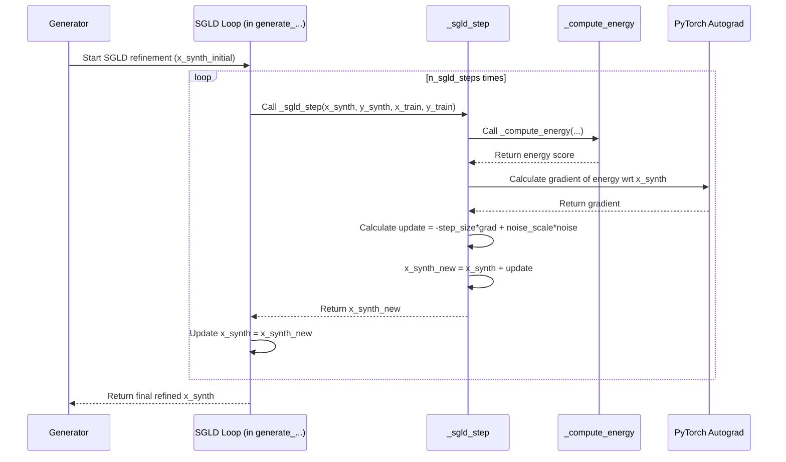

# Chapter 5: SGLD Sampling (`_sgld_step`) - Refining the Raw Material

Welcome to Chapter 5! In the previous chapters, especially [Chapter 3: Classification Generation (`generate_classification`)](03_classification_generation___generate_classification___.md) and [Chapter 4: Regression Generation (`generate_regression`)](04_regression_generation___generate_regression___.md), we saw how `TabPFGen` generates synthetic features (`X_synth`). We mentioned a "refinement process" or an "SGLD loop". Now, we'll dive into the heart of that process: **Stochastic Gradient Langevin Dynamics (SGLD)**, and specifically the function that performs each small step: `_sgld_step`.

## Motivation: From Random Noise to Realistic Data

Imagine you want to sculpt a realistic cat statue. You start with a shapeless lump of clay. How do you turn it into something that looks like a cat? You don't just make one big change! Instead, you make many small, careful adjustments – shaving off a bit here, adding a tiny piece there, smoothing an edge. You might look back and forth at pictures of real cats to guide your adjustments.

Generating synthetic data with `TabPFGen` is similar. We usually start with points that are essentially random noise (our "lump of clay"). We need a way to gradually adjust these random points so they start looking like the *real* data points in your original dataset (`X_train`). SGLD is the mathematical technique `TabPFGen` uses for this gradual refinement.

## What is Stochastic Gradient Langevin Dynamics (SGLD)?

It sounds complicated, but let's break it down:

*   **Gradient:** Think of a "hill" representing how "unrealistic" our current synthetic data points are. High points mean very unrealistic, low points mean more realistic (like the original data). The **gradient** tells us the *steepest downhill direction* from our current position on the hill. We want to move downhill towards more realistic data. This "hill" is defined by something called the [Energy Function (`_compute_energy`)](06_energy_function____compute_energy___.md), which we'll explore in the next chapter.
*   **Langevin Dynamics:** This combines two ideas:
    1.  **Moving Downhill:** Taking small steps in the direction the gradient tells us (like a ball rolling down the hill).
    2.  **Adding Randomness:** Adding a tiny bit of random "jiggling" or noise at each step (like the ball getting randomly bumped as it rolls).
*   **Stochastic:** This just means "random". The "random jiggling" makes the process stochastic.

**Analogy:** Imagine our synthetic data point is a tiny ball placed on a bumpy landscape (the "energy landscape" defined by how well it matches the real data).
1.  The **gradient** tells the ball which way is downhill.
2.  The ball takes a small step **downhill** (trying to become more realistic).
3.  The ball gets a random **nudge** (noise).

Repeating this process many times helps the ball explore the landscape and eventually settle into a low valley (a realistic configuration), without getting permanently stuck in tiny bumps along the way.

## The `_sgld_step` Function: One Small Adjustment

The SGLD process involves many, many small steps (controlled by `n_sgld_steps` you set in [Chapter 1: The `TabPFGen` Class - Your Synthetic Data Control Panel](01_tabpfgen_class_.md)). The function `_sgld_step` inside `TabPFGen` is responsible for performing *just one* of these tiny refinement steps.

Think of it as the single action of the sculptor's tool: one scrape, one smooth, one nudge.

**What it takes in:**

*   `x_synth`: The *current* positions (features) of our synthetic data points (tensor).
*   `y_synth`: The *target labels/values* assigned to these synthetic points (tensor). Used to help calculate the "energy".
*   `x_train`: The features of your *original* real data (tensor). Used for comparison.
*   `y_train`: The target labels/values of your *original* real data (tensor). Used for comparison.

**What it gives back:**

*   `x_synth_new`: The *updated* positions (features) of the synthetic data points after taking one small SGLD step (tensor).

## How One `_sgld_step` Works (Under the Hood)

Let's follow the ball on the landscape for one step:

1.  **Calculate "Unrealism" (Energy):** It first calls the `_compute_energy` function ([Chapter 6: Energy Function (`_compute_energy`)](06_energy_function____compute_energy___.md)). This function looks at the current synthetic points (`x_synth`, `y_synth`) and compares them to the real data (`x_train`, `y_train`) to calculate an "energy" score – higher energy means less realistic.
2.  **Find Downhill Direction (Gradient):** It calculates the *gradient* of this energy with respect to `x_synth`. This gradient is like an arrow pointing uphill; we want to go the *opposite* way.
3.  **Take a Step Downhill:** It updates `x_synth` by moving a small distance *against* the gradient. The size of this step is controlled by `sgld_step_size` (a parameter of `TabPFGen`).
    `step_downhill = - sgld_step_size * gradient`
4.  **Add Random Jiggle (Noise):** It adds a small amount of random noise to the updated position. The amount of noise is controlled by `sgld_noise_scale` (another `TabPFGen` parameter). This helps explore and avoid getting stuck.
    `noise_added = sgld_noise_scale * random_gaussian_noise`
5.  **Final Update:** The new position is the result of the downhill step plus the noise.
    `x_synth_new = x_synth + step_downhill + noise_added`
6.  **Return:** The function returns this `x_synth_new`.

## A Glimpse at the Code (`src/tabpfgen/tabpfgen.py`)

Here's a simplified view of what the `_sgld_step` function does:

```python
# Simplified view from src/tabpfgen/tabpfgen.py
import torch
import numpy as np

class TabPFGen:
    # ... (Assume __init__ stores sgld_step_size, sgld_noise_scale) ...
    # ... (Assume _compute_energy function exists) ...

    def _sgld_step(
        self,
        x_synth: torch.Tensor, # Current synthetic features
        y_synth: torch.Tensor, # Current synthetic targets
        x_train: torch.Tensor, # Real features
        y_train: torch.Tensor  # Real targets
    ) -> torch.Tensor: # Returns updated synthetic features

        # Make sure we can calculate gradients for x_synth
        x_synth = x_synth.clone().detach().requires_grad_(True)

        # 1. Calculate Energy (How 'unrealistic' is x_synth?)
        # (Calls the function from Chapter 6)
        energy = self._compute_energy(x_synth, y_synth, x_train, y_train)
        energy_sum = energy.sum() # We need a single value to get gradient

        # 2. Calculate Gradient (Which way is 'uphill'?)
        grad = torch.autograd.grad(energy_sum, x_synth)[0]
        # (Handle cases where gradient might be missing)
        if grad is None:
            grad = torch.zeros_like(x_synth)

        # 3. Calculate the Downhill Step amount
        gradient_step = -self.sgld_step_size * grad

        # 4. Calculate the Random Noise amount
        # (Noise depends on step size too, for technical reasons)
        noise = torch.randn_like(x_synth) * np.sqrt(2 * self.sgld_step_size)
        noise_scaled = self.sgld_noise_scale * noise

        # 5. Update x_synth: current position + downhill step + noise
        x_synth_new = x_synth + gradient_step + noise_scaled

        # 6. Return the updated synthetic features
        return x_synth_new.detach() # Return tensor without gradient info
```

This code directly follows the steps: compute energy, compute gradient, calculate the update using `sgld_step_size` and `sgld_noise_scale`, and return the new `x_synth`.

## The SGLD Loop: Many Small Steps Make a Big Difference

Remember, `_sgld_step` is just *one* step. The main generation methods (`generate_classification`, `generate_regression`) call this function repeatedly inside a loop, `n_sgld_steps` times.

```python
# Simplified loop inside generate_classification / generate_regression

# ... (Initialization of x_synth, y_synth, x_train, y_train) ...

print(f"Starting SGLD for {self.n_sgld_steps} steps...")
for step in range(self.n_sgld_steps):
    # Call the SGLD update function (the core of this chapter!)
    x_synth = self._sgld_step(x_synth, y_synth, x_train, y_train)

    # (Optional: Print progress)
    if step % 100 == 0:
        print(f"Step {step}/{self.n_sgld_steps}")

print("SGLD refinement finished.")
# ... (Now x_synth contains the refined features) ...
```

Each time through the loop, `x_synth` gets slightly refined, moving gradually from random noise towards points that resemble the real data distribution.

Let's visualize this loop:



This shows how the `_sgld_step` function is called repeatedly, using the [Energy Function (`_compute_energy`)](06_energy_function____compute_energy___.md) and gradient calculation in each iteration to update the synthetic features (`x_synth`).

## Why the Noise Matters

Why add randomness? Why not just roll straight downhill?

*   **Exploration:** The energy landscape can be bumpy. Purely downhill movement might get stuck in a small, nearby dip (a "local minimum") that isn't the best overall valley (the "global minimum" representing the true data distribution). The random noise helps "kick" the ball out of these small dips, allowing it to explore more of the landscape and find better valleys.
*   **Matching the Distribution:** SGLD, with the right noise level, is theoretically guaranteed to eventually produce samples that match the underlying probability distribution defined by the energy function. The noise is crucial for this property.

## Conclusion

You've now peeked into the engine room of `TabPFGen`'s feature generation process! You learned about SGLD – the technique of taking small, noisy steps downhill on an "energy landscape" to refine random noise into realistic data. You saw how the `_sgld_step` function implements one such step, using the gradient of the energy and adding controlled noise. This iterative process, repeated many times, is what allows `TabPFGen` to sculpt synthetic features that mimic your original data.

But what *exactly* defines that "energy landscape"? How does `TabPFGen` know what's "realistic" or "unrealistic"? That's the job of the energy function. Let's explore that next in [Chapter 6: Energy Function (`_compute_energy`)](06_energy_function____compute_energy___.md).

---

Generated by [AI Codebase Knowledge Builder](https://github.com/The-Pocket/Tutorial-Codebase-Knowledge)