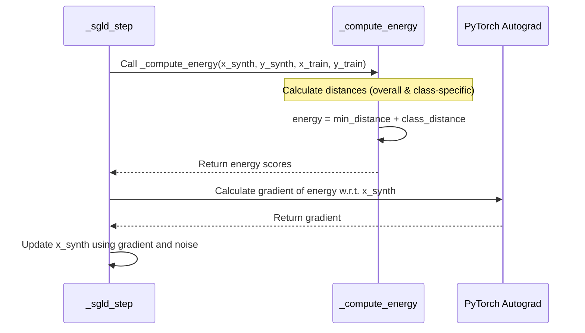

# Chapter 6: Energy Function (`_compute_energy`)

In [Chapter 5: SGLD Sampling (`_sgld_step`)](05_sgld_sampling____sgld_step___.md), we learned how `TabPFGen` uses SGLD to gradually refine random noise into realistic synthetic data features. We compared this to a tiny ball rolling downhill on a bumpy landscape. But how does the ball know which way is "downhill"? How does SGLD know what "realistic" means?

That's where the **Energy Function**, implemented in the `_compute_energy` method, comes in. It acts as the map or the terrain for our SGLD process.

## Motivation: Giving Direction to SGLD

Imagine you're lost in a hilly area at night, and you want to find the lowest valley (maybe there's a town there!). You can feel the slope of the ground beneath your feet. This feeling tells you which way is downhill.

The `_compute_energy` function does something similar for the SGLD process. It calculates a "score" (we call it "energy") for each synthetic data point being generated.

*   **Low Energy:** Means the point is "good" – it looks similar to the real data points in your original dataset. These are the valleys on our map.
*   **High Energy:** Means the point is "bad" – it looks quite different from the real data points. These are the hills or peaks.

The SGLD process uses this energy score to figure out the "downhill" direction (the gradient) and takes steps towards the low-energy valleys, making the synthetic data more realistic over time.

## What is the Energy Function?

The `_compute_energy` function calculates this score based on how well a potential synthetic data point fits in with the original data you provided (`X_train`, `y_train`). It mainly considers two things:

1.  **Overall Similarity (Feature Distance):** How close are the features of the synthetic point (`x_synth`) to the features of *any* real data point (`x_train`)? We want our synthetic points to be near *some* real data.
2.  **Group Similarity (Class Consideration - for Classification):** If we're generating data for classification (like "Spam" vs "Not Spam"), does a synthetic point labelled "Spam" actually look similar to the *real* "Spam" examples? We want synthetic points to fit well within their assigned group.

**Analogy:** Imagine judging a painting of a cat someone made.
1.  Does it look like *any* real cat you've ever seen? (Overall Similarity)
2.  If they *claim* it's a painting of a Siamese cat, does it actually resemble other Siamese cats? (Group Similarity)

The energy function combines these aspects into a single score. A lower score means the synthetic point is doing well on both counts.

## How `_compute_energy` Calculates the Score (Conceptual)

Let's peek inside the calculation for a single synthetic point (`x_synth` with its label `y_synth`) compared against the whole real dataset (`x_train`, `y_train`):

1.  **Calculate All Distances:** It measures the distance (e.g., Euclidean distance) between our one `x_synth` and *every single* `x_train` point. We get a list of distances.
2.  **Find Closest Real Point:** It finds the *smallest* distance in that list. This tells us how close `x_synth` is to its nearest neighbor in the real data. Let's call this `min_distance`.
3.  **Calculate In-Class Distances (Classification):** It looks only at the real data points (`x_train`) that have the *same label* as our synthetic point (`y_synth`). It calculates the distances from `x_synth` to just these same-class real points.
4.  **Average In-Class Distance:** It averages the distances calculated in step 3. This tells us, on average, how close `x_synth` is to the other points *in its own claimed group*. Let's call this `class_distance`.
5.  **Combine Scores:** The final energy score for this `x_synth` is calculated by combining `min_distance` and `class_distance` (in the actual code, it's simply `energy = min_distance + class_distance`).

A synthetic point gets a low energy score if it's close to *some* real point (`min_distance` is small) AND it's reasonably close to other real points of its *own class* (`class_distance` is small).

*(Note: For regression tasks, the class-specific part is less critical, and the energy often focuses more on the overall feature similarity, `min_distance`.)*

## Role in SGLD: The Guiding Landscape

The `_compute_energy` function is called inside every single `_sgld_step` (from [Chapter 5: SGLD Sampling (`_sgld_step`)](05_sgld_sampling____sgld_step___.md)).

1.  `_sgld_step` gives the current synthetic points (`x_synth`, `y_synth`) and the real data (`x_train`, `y_train`) to `_compute_energy`.
2.  `_compute_energy` calculates the energy score for each synthetic point.
3.  `_sgld_step` uses PyTorch's automatic differentiation to find the *gradient* of this energy score with respect to `x_synth`. This gradient points "uphill".
4.  `_sgld_step` moves `x_synth` slightly in the *opposite* direction (downhill), plus some noise.

This loop repeats, constantly using the energy function to guide the synthetic points towards the low-energy valleys representing realistic data distributions.

## Under the Hood: Looking at the Code

Let's visualize how `_sgld_step` uses `_compute_energy`:



Now, let's look at a simplified version of the `_compute_energy` function from `src/tabpfgen/tabpfgen.py`:

```python
# Simplified view from src/tabpfgen/tabpfgen.py
import torch

class TabPFGen:
    # ... (other methods like __init__, _sgld_step) ...

    def _compute_energy(
        self,
        x_synth: torch.Tensor, # Synthetic features (e.g., [100, 15])
        y_synth: torch.Tensor, # Synthetic labels (e.g., [100])
        x_train: torch.Tensor, # Real features (e.g., [500, 15])
        y_train: torch.Tensor  # Real labels (e.g., [500])
    ) -> torch.Tensor:         # Returns energy score per synthetic point (e.g., [100])
        """
        Compute differentiable energy score based on distances.
        """
        # 1. Calculate all pairwise distances between synthetic and real points
        # Result 'distances' has shape [n_synth, n_train] (e.g., [100, 500])
        distances = torch.cdist(x_synth, x_train)

        # 2. Find the distance to the *closest* real point for each synthetic point
        # min_distances has shape [n_synth] (e.g., [100])
        min_distances, _ = distances.min(dim=1)

        # --- Class-conditional part (more relevant for classification) ---

        # 3. Create a mask: True where synth label matches train label
        # Example: y_synth [0, 1], y_train [0, 0, 1]
        # -> mask = [[T, T, F],  # Synth 0 matches Train 0, Train 0
        #            [F, F, T]]  # Synth 1 matches Train 1
        # Shape: [n_synth, n_train] (e.g., [100, 500])
        class_mask = (y_synth.unsqueeze(1) == y_train.unsqueeze(0))

        # 4. Calculate average distance to points *of the same class*
        #   - Zero out distances where classes don't match
        #   - Sum remaining distances per synthetic point
        #   - Divide by the number of matching real points (+ small epsilon for safety)
        # class_distances has shape [n_synth] (e.g., [100])
        class_masked_distances = distances * class_mask.float()
        class_distances = class_masked_distances.sum(dim=1) / (class_mask.float().sum(dim=1) + 1e-6)

        # 5. Combine the scores: overall closest + average in-class distance
        energy = min_distances + class_distances

        return energy # Shape [n_synth]
```

**Explanation:**

*   `torch.cdist(x_synth, x_train)` efficiently computes the distance between every point in `x_synth` and every point in `x_train`.
*   `.min(dim=1)` finds the minimum distance along the dimension corresponding to the training samples, giving the distance to the single nearest neighbor for each synthetic point.
*   The `class_mask` is a clever trick using broadcasting (`unsqueeze`) to create a boolean matrix indicating where the labels match between synthetic and training points.
*   Multiplying `distances` by `class_mask.float()` effectively zeroes out distances to points of different classes.
*   `.sum(dim=1)` then sums the distances to same-class points, and dividing by `class_mask.float().sum(dim=1)` gives the average distance within that class.
*   Finally, `min_distances + class_distances` provides the combined energy score, guiding SGLD based on both overall proximity and class consistency.

## Conclusion

You've now learned about the crucial role of the **Energy Function (`_compute_energy`)** in `TabPFGen`. It acts as the guiding map for the SGLD sampling process, providing a score that tells us how "realistic" a synthetic data point is by comparing it to the original data based on feature distances and class similarity. By calculating the gradient of this energy, SGLD knows which direction to move in to generate data that lies in the low-energy valleys, mimicking the true data distribution.

We've seen how `TabPFGen` sets up the process, integrates with TabPFN, performs generation for classification and regression, refines features using SGLD, and uses the energy function to guide that refinement. But how do we know if the final synthetic data is actually any good? How can we check if it truly resembles the original data?

In the next chapter, we'll explore the tools provided by `TabPFGen` to help us answer these questions: [Chapter 7: Visualization (`visuals.py`)](07_visualization___visuals_py___.md).

---

Generated by [AI Codebase Knowledge Builder](https://github.com/The-Pocket/Tutorial-Codebase-Knowledge)