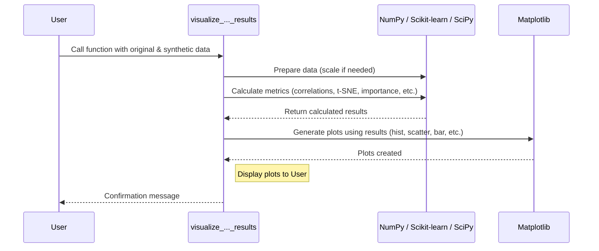

# Chapter 7: Visualization (`visuals.py`) - Checking Your Synthetic Data Quality

We've journeyed through the core of `TabPFGen`, learning how it sets up ([Chapter 1: The `TabPFGen` Class - Your Synthetic Data Control Panel](01_tabpfgen_class_.md)), uses its smart assistant ([Chapter 2: TabPFN Integration - The Smart Assistant Inside](02_tabpfn_integration_.md)), generates different types of data ([Chapter 3](03_classification_generation___generate_classification___.md) & [Chapter 4](04_regression_generation___generate_regression___.md)), refines it using SGLD ([Chapter 5: SGLD Sampling (`_sgld_step`)](05_sgld_sampling____sgld_step___.md)), and guides that refinement with an energy function ([Chapter 6: Energy Function (`_compute_energy`)](06_energy_function____compute_energy___.md)).

But after all that work, how do we know if the synthetic data we created is actually any good? Does it really look like the original data? This is where the `visuals.py` module comes in – it's like the **quality control dashboard** for your synthetic data factory.

## Motivation: Why Look at Pictures?

Imagine you ordered a custom-made chair that's supposed to look exactly like your favorite antique chair. When it arrives, you wouldn't just assume it's perfect – you'd *look* at it! You'd compare it side-by-side with the original. Does it have the same shape? The same color? The same details?

Similarly, when `TabPFGen` creates synthetic data, we need to check if it successfully captured the important patterns and characteristics of the original data. Just because the generation process finished doesn't automatically mean the result is useful. `visuals.py` gives us the tools to perform this visual inspection easily.

## The Visualization Toolkit: `visuals.py`

The `visuals.py` module contains functions that generate a set of useful comparison plots. These plots put your original data and the synthetic data side-by-side, making it easier to spot similarities and differences.

There are two main functions, one for each type of task we learned about:

1.  `visualize_classification_results`: For checking synthetic data from classification tasks (like our "Spam" vs "Not Spam" example).
2.  `visualize_regression_results`: For checking synthetic data from regression tasks (like our house price prediction example).

Let's see how to use them!

## Checking Classification Data (`visualize_classification_results`)

Suppose we generated synthetic email data (`X_synth_emails`, `y_synth_labels`) based on our original email data (`X_emails`, `y_labels`) as we discussed in [Chapter 3: Classification Generation (`generate_classification`)](03_classification_generation___generate_classification___.md). Now, we want to see how well they match up.

```python
# Assume X_emails, y_labels are your original data (NumPy arrays)
# Assume X_synth_emails, y_synth_labels are the generated data (NumPy arrays)
# Assume 'email_feature_names' is a list of names for the columns in X_emails

# --- Let's imagine some simple fake data again ---
import numpy as np
# Original data (50 samples, 10 features)
X_emails = np.random.rand(50, 10)
y_labels = np.array([0]*45 + [1]*5) # Imbalanced
# Synthetic data (100 samples, 10 features, balanced)
X_synth_emails = np.random.rand(100, 10) * 1.1 # Slightly different distribution
y_synth_labels = np.array([0]*50 + [1]*50) # Balanced
email_feature_names = [f'Word_{i+1}_Count' for i in range(10)]
# --- End of fake data setup ---

# Import the visualization function
from tabpfgen.visuals import visualize_classification_results

# Generate the comparison plots
visualize_classification_results(
    X_orig=X_emails,
    y_orig=y_labels,
    X_synth=X_synth_emails,
    y_synth=y_synth_labels,
    feature_names=email_feature_names # Optional: makes plots clearer
)

print("Classification visualization generated!")
# Expected Output:
# (A window or inline display showing several plots will appear)
# Classification visualization generated!
```

This simple call takes your original and synthetic data (features `X` and labels `y`) and produces a series of plots.

### What Do the Classification Plots Show?

Running the code above will display several plots (usually in two figure windows). Let's understand what they tell us:

1.  **Class Distribution Comparison:** A bar chart showing the count of each class (e.g., "Not Spam" vs "Spam") in the original data versus the synthetic data. This helps verify if `balance_classes=True` worked as expected or if the synthetic data mimics the original distribution.
2.  **t-SNE Visualization:** This is a clever way to plot high-dimensional data (data with many features) in 2D. Points that are similar in the original high-dimensional space should appear close together in the 2D plot. You'll see clusters of original data points (circles) and synthetic data points (crosses), colored by their class label. Ideally, the synthetic clusters should overlap well with the original clusters of the same color, indicating that the synthetic data captures the overall structure.
3.  **Top 5 Important Features:** Shows a bar chart of the features that a simple model (like RandomForest) found most important for predicting the class label *in the original data*. This helps identify key features.
4.  **Distribution of Top Feature:** Shows histograms comparing the distribution of values for the *most important feature* identified above. It plots the original and synthetic data distributions side-by-side for each class. You want to see if the shapes of the synthetic histograms roughly match the shapes of the original ones for the same class.
5.  **Feature Correlation Matrices:** Two heatmaps showing how features relate to each other (correlation) in the original data versus the synthetic data. If two features strongly increase together in the original data (bright red square), they should ideally show a similar pattern in the synthetic data's heatmap. We look for similar overall patterns and colors in both heatmaps.

These plots together give you a good visual assessment of whether the synthetic classification data is statistically similar to the original.

## Checking Regression Data (`visualize_regression_results`)

Now, let's say we generated synthetic house price data (`X_synth_housing`, `y_synth_prices`) based on original data (`X_housing`, `y_prices`) as discussed in [Chapter 4: Regression Generation (`generate_regression`)](04_regression_generation___generate_regression___.md). We use the corresponding visualization function:

```python
# Assume X_housing, y_prices are your original data (NumPy arrays)
# Assume X_synth_housing, y_synth_prices are the generated data (NumPy arrays)
# Assume 'housing_feature_names' is a list of names for the columns in X_housing

# --- Let's imagine some simple fake data again ---
import numpy as np
# Original data (60 samples, 2 features)
X_housing = np.random.rand(60, 2) * np.array([[2000, 4]]) + np.array([[500, 1]])
y_prices = 50000 + X_housing[:, 0] * 100 + X_housing[:, 1] * 10000 + np.random.randn(60) * 10000
# Synthetic data (120 samples, 2 features)
X_synth_housing = np.random.rand(120, 2) * np.array([[2100, 4.5]]) + np.array([[450, 0.8]])
y_synth_prices = 50000 + X_synth_housing[:, 0] * 100 + X_synth_housing[:, 1] * 10000 + np.random.randn(120) * 12000
housing_feature_names = ['Sq_Footage', 'Bedrooms']
# --- End of fake data setup ---

# Import the visualization function
from tabpfgen.visuals import visualize_regression_results

# Generate the comparison plots
visualize_regression_results(
    X_orig=X_housing,
    y_orig=y_prices,
    X_synth=X_synth_housing,
    y_synth=y_synth_prices,
    feature_names=housing_feature_names # Optional
)

print("Regression visualization generated!")
# Expected Output:
# (A window or inline display showing several plots will appear)
# Regression visualization generated!
```

Again, this function takes the original and synthetic data and displays several comparison plots (often across four figure windows).

### What Do the Regression Plots Show?

1.  **Distribution Comparison (Histogram):** Compares the histograms of the target variable (`y_orig` vs `y_synth`). You want to see if the overall shape, center, and spread of the synthetic target values look similar to the original ones.
2.  **Q-Q Plot (Synthetic):** This plot compares the distribution of the synthetic target values (`y_synth`) against a standard normal distribution. If the points fall roughly along the diagonal line, it suggests the synthetic data is somewhat normally distributed (after potential scaling). It helps assess the shape of the synthetic distribution.
3.  **Box Plot Comparison:** Shows box plots for the original and synthetic target values side-by-side. This makes it easy to compare the median (middle line), the interquartile range (the box), and potential outliers (points outside the whiskers).
4.  **Top 5 Important Features:** Similar to classification, this shows which features a simple regression model (RandomForestRegressor) found most important for predicting the target value *in the original data*.
5.  **Top Feature vs Target (Scatter Plot):** A scatter plot showing the relationship between the most important feature and the target variable. It plots original data points (blue) and synthetic data points (red). You want to see if the synthetic points follow a similar trend or pattern as the original points.
6.  **t-SNE Visualization:** Similar to classification, but here the points are colored by their *target value* (e.g., low prices might be yellow, high prices might be dark purple). Again, you look for similar clustering and color patterns between original (circles) and synthetic (crosses) points.
7.  **Residuals Distribution:** Shows histograms of the difference between each target value and the overall mean target value (residuals) for both original and synthetic data. Similar shapes suggest similar variance around the mean.
8.  **Target Value Range Coverage:** Plots the percentiles of the target values for original vs. synthetic data. If the lines are close, it suggests the synthetic data covers a similar range of values as the original data.
9.  **Feature Correlation Matrices:** Just like in classification, these heatmaps compare the feature-to-feature correlations in the original and synthetic datasets. Look for similar patterns.

These plots provide a comprehensive visual check for the quality of your synthetic regression data.

## How Does Visualization Work Under the Hood?

The `visualize_...` functions are essentially convenient wrappers around standard data science libraries. They don't perform magic, they just automate the common steps needed for these comparisons.

1.  **Data Preparation:** Sometimes, data might be scaled (e.g., using `StandardScaler` from Scikit-learn) before plotting, especially for t-SNE, to ensure features are comparable.
2.  **Calculations:** They use libraries like:
    *   **NumPy:** For basic array operations and calculations (like correlations with `np.corrcoef`).
    *   **Scikit-learn:** For more complex analyses like t-SNE (`sklearn.manifold.TSNE`) and calculating feature importances (`sklearn.ensemble.RandomForestClassifier/Regressor`).
    *   **SciPy:** For statistical plots like the Q-Q plot (`scipy.stats.probplot`).
    *   **Collections:** For counting class occurrences (`collections.Counter`).
3.  **Plotting:** They use **Matplotlib** (`matplotlib.pyplot`) to actually draw all the histograms, scatter plots, bar charts, and heatmaps you see.

Here's a simplified view of the process:



Looking inside `src/tabpfgen/visuals.py`, you'll find standard Python code using these libraries to create the figures and subplots, calculate the necessary values, and call Matplotlib functions like `plt.hist`, `plt.scatter`, `plt.bar`, `plt.imshow`, etc.

```python
# Simplified conceptual snippet from src/tabpfgen/visuals.py

import numpy as np
import matplotlib.pyplot as plt
from sklearn.manifold import TSNE
from sklearn.preprocessing import StandardScaler
# ... other necessary imports ...

def visualize_classification_results(X_orig, y_orig, X_synth, y_synth, feature_names=None):
    # --- 1. Prepare Data (Example: for t-SNE) ---
    X_combined = np.vstack([X_orig, X_synth])
    scaler = StandardScaler()
    X_combined_scaled = scaler.fit_transform(X_combined)

    # --- 2. Perform Calculations (Example: t-SNE) ---
    tsne = TSNE(n_components=2, random_state=42)
    X_tsne = tsne.fit_transform(X_combined_scaled)
    # (Split X_tsne back into original and synthetic parts)

    # --- 3. Plotting (Example: t-SNE subplot) ---
    plt.figure(figsize=(10, 5)) # Create a figure
    plt.subplot(1, 2, 1) # Create a subplot area
    # (Loop through classes and plot original points using plt.scatter)
    # (Loop through classes and plot synthetic points using plt.scatter)
    plt.title('t-SNE Visualization')
    plt.legend()
    plt.grid(True)

    # --- (Repeat steps 2 & 3 for other plot types: histograms, correlations etc.) ---
    # Example: Correlation plot
    plt.subplot(1, 2, 2)
    orig_corr = np.corrcoef(X_orig.T) # Calculation using NumPy
    plt.imshow(orig_corr, cmap='coolwarm') # Plotting using Matplotlib
    plt.title('Original Feature Correlations')
    plt.colorbar()

    plt.tight_layout() # Adjust spacing
    plt.show() # Display the plots
```

This simplified example shows the pattern: prepare data, calculate metrics using libraries like NumPy or Scikit-learn, and then use Matplotlib to create the visual representations.

## Conclusion: Trust, But Verify!

You've now learned how to use the `visuals.py` module to act as a quality control check for your synthetic data generation process. By comparing various statistical properties visually – distributions, correlations, feature importance, and data structure via t-SNE – you can gain confidence that the synthetic data generated by `TabPFGen` is a faithful representation of your original dataset. Remember, generating data is only half the battle; verifying its quality is just as important!

This chapter concludes our tour through the main components of the `TabPFGen` library. We hope this tutorial has given you a solid foundation for understanding how `TabPFGen` works and how you can use it to generate valuable synthetic tabular data for your own projects. Happy generating!

---

Generated by [AI Codebase Knowledge Builder](https://github.com/The-Pocket/Tutorial-Codebase-Knowledge)