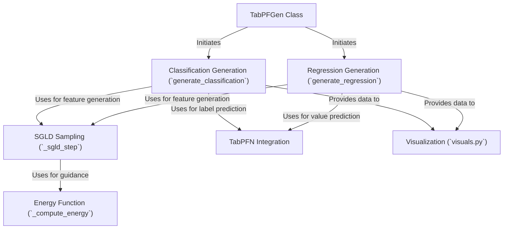

# Tutorial: TabPFGen

`TabPFGen` is a tool designed to create **synthetic** (*artificial*) tabular data that mimics real datasets. This is useful when you have *limited* real data, need to *protect privacy*, or want to *balance* your dataset. It cleverly uses a pre-trained model called **TabPFN** and an iterative refinement process (**SGLD**) guided by an **Energy Function** to generate realistic features. Finally, it uses TabPFN again to predict corresponding target values (*classification* or *regression*). The library also includes **visualization** tools to help you check if the generated data statistically resembles the original.

**Source Repository:** [https://github.com/sebhaan/TabPFGen](https://github.com/sebhaan/TabPFGen)

## Chapters

1. [TabPFGen Class
](01_tabpfgen_class_.md)
2. [TabPFN Integration
](02_tabpfn_integration_.md)
3. [Classification Generation (`generate_classification`)
](03_classification_generation___generate_classification___.md)
4. [Regression Generation (`generate_regression`)
](04_regression_generation___generate_regression___.md)
5. [SGLD Sampling (`_sgld_step`)
](05_sgld_sampling____sgld_step___.md)
6. [Energy Function (`_compute_energy`)
](06_energy_function____compute_energy___.md)
7. [Visualization (`visuals.py`)
](07_visualization___visuals_py___.md)

---

Generated by [AI Codebase Knowledge Builder](https://github.com/The-Pocket/Tutorial-Codebase-Knowledge)
